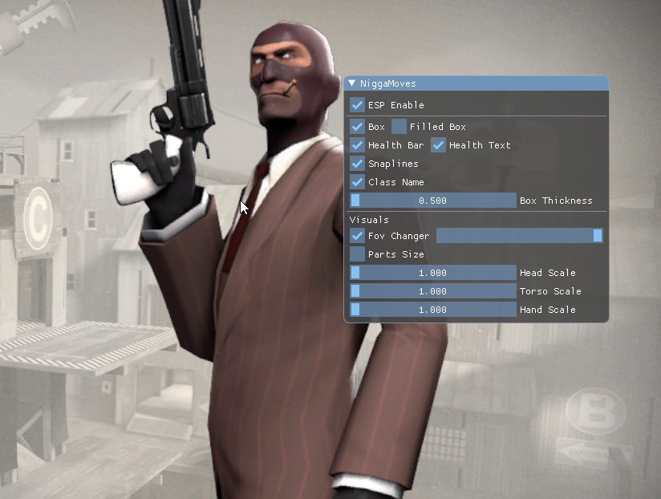
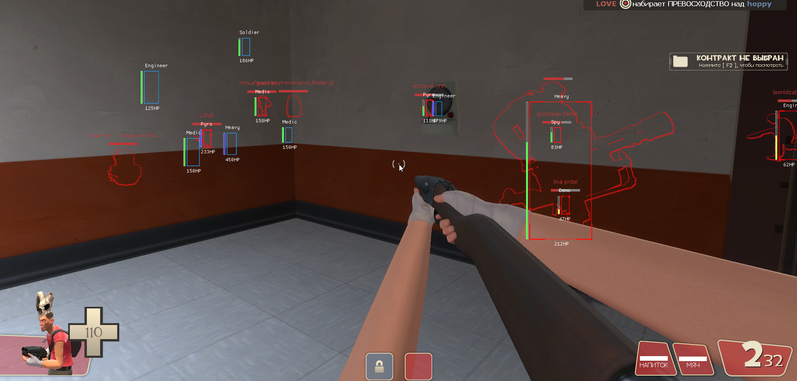

# tf2-internal_shit-esp

  
  

Another shitty hardcoded esp hack for tf2 with lags and bugs but working.

Tested on VAC enabled servers without -insecure

1. Build as x64 DLL
2. Inject into `tf_win64.exe`
Use https://github.com/TheCruZ/Simple-Manual-Map-Injector for injection

## Build Requirements
- Visual Studio 2026
- DirectX 9 SDK